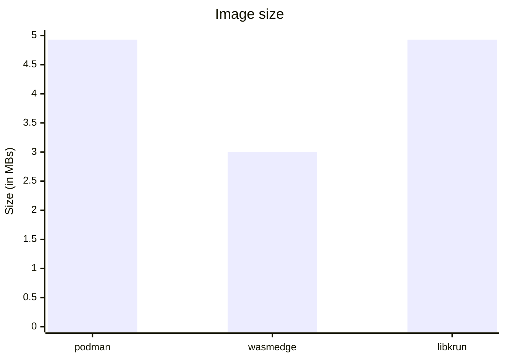
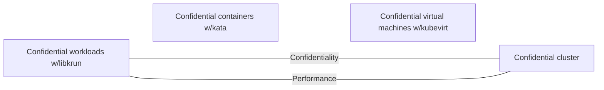

```mermaid
xychart-beta
    title "Image size"
    x-axis [podman, wasmedge, libkrun]
    y-axis "Size (in MBs)" 0 --> 5
    bar [4.93, 3, 4.93]
```

```mermaid
flowchart LR
    AE[Confidential workloads] ~~~ B
```

```mermaid
flowchart LR
    CW[Confidential workloads w/libkrun] ~~~ CCn[Confidential containers w/kata] ~~~ CVM[Confidential virtual machines w/kubevirt] ~~~ CCl[Confidential cluster]
    CCl-- Performance ---CW
    CW-- Confidentiality ---CCl
```
